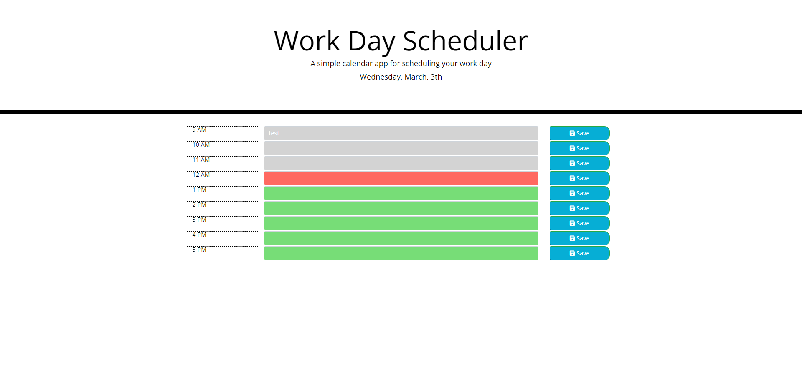
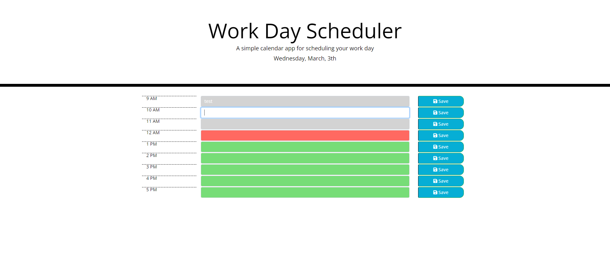

# 05-02-challenge

## Description

This was a daily planner for the current day and stores the data locally in the local storage of web browser. This site was made using JQuery and Moment.js. This solves the problem of setting daily planner for an individual for the current day. I learned how to go through JQuery and how to go through the DOM tree using it. 

## Table of Contents (Optional)

- [Installation](#installation)
- [Usage](#usage)
- [Credits](#credits)
- [License](#license)

## Installation

Git clone https://github.com/JaberSE09/05-02-challenge.git to a local folder and run the index.html file

## Usage

    https://jaberse09.github.io/05-02-challenge/ to run the application

    ```md
    
    ```

    ```md
    
    ```


## Credits

Sajid Jaber

## License

Copyright (c) [2022] [Sajid Jaber]

Permission is hereby granted, free of charge, to any person obtaining a copy
of this software and associated documentation files (the "Software"), to deal
in the Software without restriction, including without limitation the rights
to use, copy, modify, merge, publish, distribute, sublicense, and/or sell
copies of the Software, and to permit persons to whom the Software is
furnished to do so, subject to the following conditions:

The above copyright notice and this permission notice shall be included in all
copies or substantial portions of the Software.

THE SOFTWARE IS PROVIDED "AS IS", WITHOUT WARRANTY OF ANY KIND, EXPRESS OR
IMPLIED, INCLUDING BUT NOT LIMITED TO THE WARRANTIES OF MERCHANTABILITY,
FITNESS FOR A PARTICULAR PURPOSE AND NONINFRINGEMENT. IN NO EVENT SHALL THE
AUTHORS OR COPYRIGHT HOLDERS BE LIABLE FOR ANY CLAIM, DAMAGES OR OTHER
LIABILITY, WHETHER IN AN ACTION OF CONTRACT, TORT OR OTHERWISE, ARISING FROM,
OUT OF OR IN CONNECTION WITH THE SOFTWARE OR THE USE OR OTHER DEALINGS IN THE
SOFTWARE
